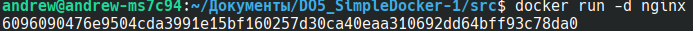
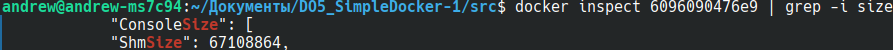
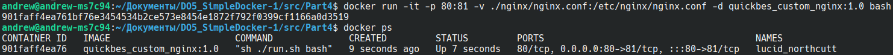
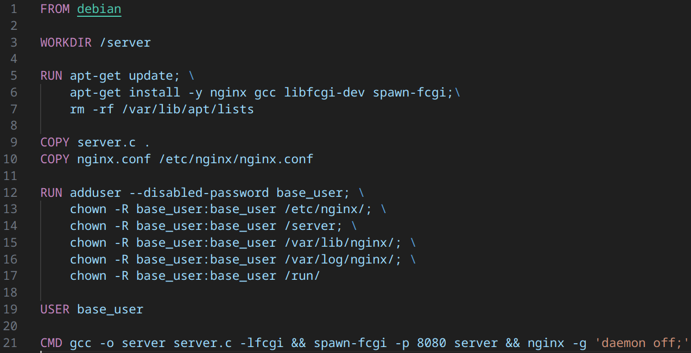
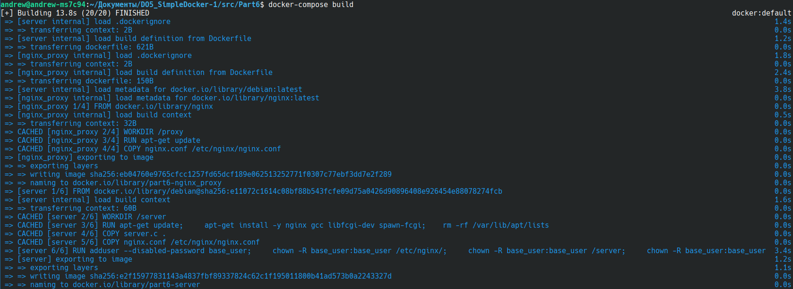

# Отчёт по DO5. Simple Docker

## Оглавление

   1. [Готовый докер](#part-1-готовый-докер)
   2. [Операции с контейнером](#part-2-операции-с-контейнером)
   3. [Мини веб-сервер](#part-3-мини-веб-сервер)
   4. [Свой докер](#part-4-свой-докер)
   5. [Dockle](#part-5-dockle)
   6. [Базовый Docker Compose](#part-6-базовый-docker-compose)


## Part 1. Готовый докер

- Установил **docker** командой `sudo snap install docker`.

- Взял официальный образ Docker с **nginx** и загрузил его с помощью `docker pull nginx`:


- Проверил наличие **докер-образа** через `docker images`:


- Запустил докер-образ через `docker run -d [image_id|repository]`:



- Проверил, что образ запустился через `docker ps`:


- Посмотрел информацию о контейнере через `docker inspect [container_id|container_name]`:

**Размер контейнера**


**Список замапленных портов**


**IP-адрес контейнера**


- Остановил докер-контейнер через `docker stop [container_id|container_name]`:


- Проверил, что контейнер остановился через `docker ps`


- Запустил докер с портами *80* и *443* в контейнере, замапленными на такие же порты на локальной машине, через команду 
`docker run -d -p 80:80 -p 443:443 nginx`:


- Проверил, что в браузере по адресу `localhost:80` доступна стартовая страница **nginx**:


- Перезапустил докер-контейнер через `docker restart [container_id|container_name]`
и проверил, что он запустился через `docker ps`:


## Part 2. Операции с контейнером

- Прочитал конфигурационный файл **nginx.conf** внутри докер-контейнера через команду `docker exec -it [container_id] cat /etc/nginx/nginx.conf`:


- Создал на локальной машине файл **nginx.conf** через *перенаправление вывода*:


- Настроил в нем по пути **/status** отдачу страницы статуса сервера nginx:


- Скопировал созданный файл **nginx.conf** внутрь докер-образа через команду `docker cp [container_id]:/etc/nginx`


- Проверил **nginx.conf** на корректность синтаксиса через `docker exec -it [container_id] nginx -t`:


- Перезагрузил **nginx** через `docker exec -it [container_id] nginx -s reload`:


- Проверил, что по адресу *localhost:80/status* отдается страничка со статусом сервера nginx:


- Экспортировал контейнер в файл *container.tar* через команду `docker export [container_id] > container.tar`.
- Затем, остановил контейнер через `docker stop [container_id]`:


- Проверяем что контейнер остановлен. После чего удаляем образ *nginx* командой `docker rmi [image_id|repository]`. При попытке удалить образ этой командой, появляется сообщение о том, что данный образ используется контейнером. Поэтому, выполняем ту же команду, но уже используя флаг `-f` для *принудительного удаления*:


- Далее, удалил остановленный контейнер командой `docker rm [container_id|container_name]`. Проверил отсуствие контейнера командой `docker ps -a`:


- Импортировал образ обратно через команду `docker import -c 'cmd ["nginx", "-g", "daemon off;"]' container.tar [image_name]`:


- Запустил импортированный образ командой `docker run -d -p 80:80 -p 443:443 [image_name]`:


- Запустил в контейнере терминал через команду `docker exec -it eager_colden bash`. В нём проверил состояние сервера nginx через команду `service nginx status`:


- Проверил, что по адресу `localhost:80/status` отдается страничка со статусом сервера nginx:


## Part 3. Мини веб-сервер

- Установил пакет **libfcgi-dev** на локальную машину.

- Написал мини-сервер на **C** и **FastCgi**, который возвращает простейшую страничку с надписью `Hello World!`:


- Запустил контейнер с помощью команды `docker run -d -p 81:81 custom_nginx`.

- С помощью команды `docker cp server.c [container id|container name]:/home` скопировал файл сервера в домашнюю директорию контейнера:


- Написал свой *nginx.conf*, который проксирует все запросы с *81* порта на *127.0.0.1:8080*:


- C помощью команды `docker cp nginx.conf [container id/container name]:/etc/nginx` скопировал конфиг в директорию nginx контейнера:


- Зашёл в контейнер командой `docker exec -it [container id|container name] bash` и терминале контейнера обновляем репозитории, и устанавливаем gcc, spawn-fcgi и libfcgi-dev:


- Скомпилировал исходный файл сервера в контейнере с помощью `gcc -o server server.c -lfcgi`. Перезапустил сервер nginx с помощью `nginx -s reload`. Запустил написанный мини-сервер через команду `spawn-fcgi -p 8080 ./server`:


- Проверил работу сервера в браузере по адресу `localhost:81`:


- Положил файл *nginx.conf* по пути `./nginx/nginx.conf`:


## Part 4. Свой докер

Написал свой докер-образ, основанный на базовом образе **nginx**, который:

1) Собирает исходники мини-сервера на FastCgi из Части 3;

2) Запускает его на 8080 порту;

3) Копирует внутрь образа написанный ./nginx/nginx.conf;

4) Запускает nginx.


- Собрал написанный *докер-образ* через `docker build . -t [image_name:image_tag]` при этом указав имя и тег:


- Проверил через `docker images`, что все собралось корректно:


- Запустил собранный Docker-образ с сопоставлением *81* порта с *80* на локальной машине, и сопоставлением папки `./nginx` внутри контейнера по адресу, где находятся конфигурационные файлы `nginx` с помощью команды `docker run -it -p 80:81 -v ./nginx/nginx.conf:/etc/nginx/nginx.conf -d quickbes_custom_nginx:1.0 bash`. Проверил что контейнер запустился через `docker ps`:



- Проверил, что по адресу `localhost:80` доступна страница написанного сервера:


- Дописал в `nginx.conf` проксирование странички */status*, по которой надо отдавать статус сервера nginx:


- Перезапустил контейнер через `docker restart [container_id|container_name]`:


- Проверил, что теперь по адресу `localhost:80/status` отображается страница со статусом nginx:


## Part 5. Dockle

- Установил утилиту *dockle* с помощью команд `VERSION=$(curl --silent "https://api.github.com/repos/goodwithtech/dockle/releases/latest" | \grep '"tag_name":' | \sed -E 's/.*"v([^"]+)".*/\1/' \) && curl -L -o dockle.deb https://github.com/goodwithtech/dockle/releases/download/v${VERSION}/dockle_${VERSION}_Linux-64bit.deb` и
`sudo dpkg -i dockle.deb && rm dockle.deb`

- Запустил проверку Docker-образа через *dockle* с помощью команды `dockle [image_id|repository]`:


- Исправил ошибки и предупреждения в `Dockerfile`:


```
Поскольку образ создается на основе официальной последней версии nginx, в Dockerfile которой используются NGINX_GPGKEY и NGINX_GPGKEY_PATH, это приводит к ложным срабатываниям предупреждений в Dockle, который в CIS-DI-0010 ищет ключевые слова (ключ, пароль).
```
- Поэтому, для проверки отсуствия ошибок и предупреждений, запустил Dockle с флагом -ak `dockle -ak NGINX_GPGKEY -ak NGINX_GPGKEY_PATH -ak NGINX_GPGKEYS quickbes_custom_nginx:1.1`:


## Part 6. Базовый Docker Compose

- Для того, чтобы собрать докер-контейнер на nginx, портирующий запросы с *8080* порта на *81* порт ранее запущенного контейнера необходимо изменить содержания конфигурационных файлов.

- Cоздал директорию `server`, где поменял настройки в файле *nginx.conf*:


- Поменял настройки в *Dockerfile* server:




- Создал файл **docker-compose.yml**:


- Остановил все запущенные контейнеры через команду `docker stop $(docker ps -q)`:


- Создал директорию `proxy`, где поменял настройки в файле *nginx.conf*:


- Поменял настройки в *Dockerfile* proxy:


- Собрал проект командой `docker-compose build`:



- Запустил проект командой `docker-compose up`:


- Проверил, что в браузере по адресу `localhost:80` доступна страница сервера:


